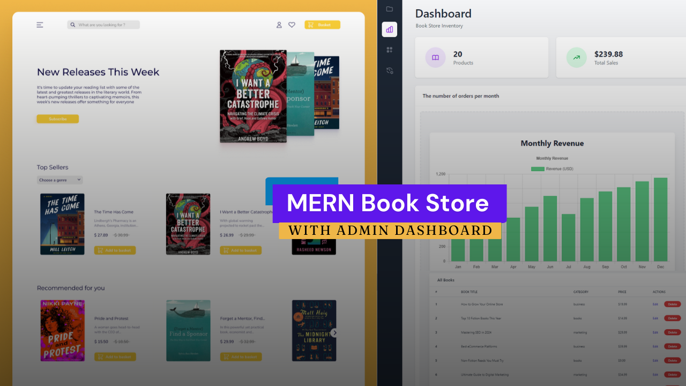

# Bookstore Application

This project covers both **frontend** and **backend** development from scratch.

## Description

The application is a complete **Bookstore** system, featuring:
- A **user-friendly interface** built with React and styled with **Tailwind CSS**.
- A **backend server** developed using Node.js and Express.js.
- A **database** powered by MongoDB.
- An **admin dashboard** for managing books and inventory.
- Features like **cash-on-delivery system** and **robust inventory management**.

## Technologies Used

- **Frontend**: React, Tailwind CSS, Redux, RTK Query Toolkit
- **Backend**: Node.js, Express.js
- **Database**: MongoDB with Mongoose
- **Authentication**: JWT (JSON Web Tokens)

## Features

- **User Functionality**:
  - Add or remove books from the cart.
  - Checkout and place orders.
  - Cash-on-delivery payment system.

- **Admin Functionality**:
  - Secure admin dashboard (username: `admin`, password: `admin`).
  - Upload new books.
  - Manage and update book information.
  - Delete books as needed.

## Preview




## Getting Started

To run this project locally, follow these steps:

### Prerequisites
- Node.js installed
- MongoDB installed and running locally or a MongoDB Atlas connection string

### Installation
1. Clone the repository:
   ```bash
   git clone https://github.com/mister-nothing00/book-store-frontend/.git
   ```
